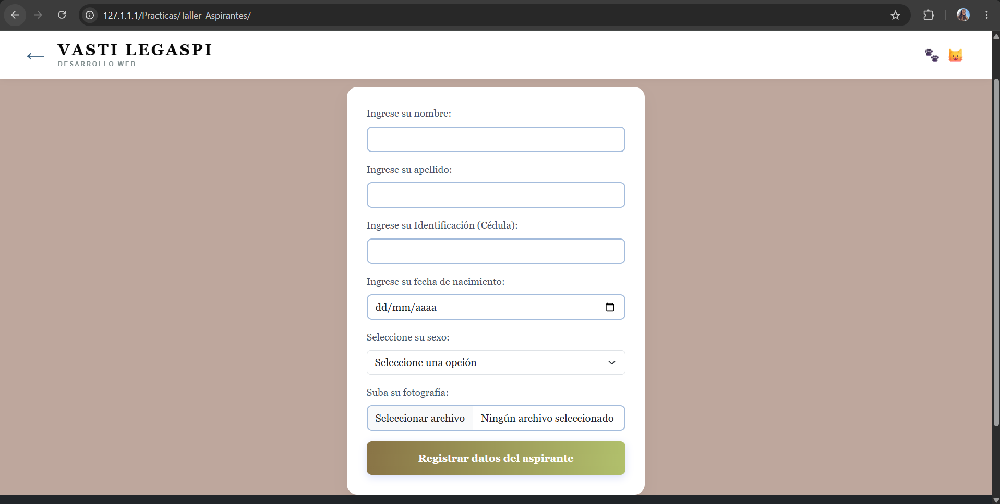

# 💼 Laboratorio 3: Registro de Aspirantes con PHP

## 1. Descripción del proyecto

Este proyecto consiste en el desarrollo de un sistema web para el registro de aspirantes, utilizando tecnologías de desarrollo web del lado del cliente y del servidor.

El sistema cuenta con un formulario mediante el cual se pueden ingresar los datos correspondientes al registro. También se contempla el manejo de imágenes y la presentación de resultados para comprobar el funcionamiento del formulario.

El propósito de este laboratorio es poner en práctica los conocimientos adquiridos en desarrollo web, la organización de archivos, el procesamiento de formularios y la gestión de la información ingresada por el usuario.

## 2. Objetivos del laboratorio

### Objetivo general

Desarrollar y ejecutar un sistema web de registro de aspirantes, aplicando herramientas y tecnologías de desarrollo web para procesar los datos ingresados mediante un formulario.

### Objetivos específicos

- Diseñar un formulario para el registro de aspirantes.
- Procesar la información enviada desde el formulario mediante PHP.
- Utilizar controles de entrada para solicitar y validar los datos.
- Incorporar imágenes y evidencias visuales al proyecto.
- Organizar los archivos del sistema en carpetas.
- Comprobar el funcionamiento del formulario mediante pruebas.
- Documentar el procedimiento de instalación y ejecución del sistema.

## 3. Tecnologías y herramientas utilizadas

| Tecnología o herramienta | Uso dentro del proyecto |
|---|---|
| HTML5 | Estructura del formulario y de las páginas web. |
| CSS3 | Presentación visual y estilos, cuando se encuentran implementados. |
| PHP | Procesamiento de los datos enviados por el formulario. |
| WampServer | Entorno local para ejecutar el proyecto. |
| Apache | Servidor web utilizado por WampServer. |
| Visual Studio Code | Editor de código fuente. |
| Git | Control de versiones del proyecto. |
| GitHub | Repositorio remoto para almacenar y compartir el código. |
| Markdown | Elaboración de este archivo README. |

### Versiones

Las versiones exactas de PHP, Apache, WampServer y las demás herramientas dependen de la instalación utilizada durante el laboratorio. Para registrar las versiones reales, se pueden consultar los siguientes comandos:

```bash
php -v
```

```bash
git --version
```

La versión de Apache y la información de WampServer se pueden consultar desde el entorno instalado. No se indican números de versión específicos porque deben corresponder a los que se utilizaron realmente en el equipo.

## 4. Estructura del proyecto

La estructura general del proyecto se organiza de la siguiente manera:

```text
Taller-Aspirantes/
│
├── index.php
├── procesar.php
│
├── includes/
│   ├── header.php
│   └── footer.php
│
├── Imagenes/
│   ├── Formulario.png
│   ├── Resultado Erroneo.png
│   └── Resultado valido.png
│
├── uploaded_files/
│   └── Archivos de imágenes cargadas
│
└── README.md
```

**Descripción de los archivos y directorios:**

- `index.php`: contiene la página principal y el formulario de registro.
- `procesar.php`: se encarga de recibir y procesar los datos enviados desde el formulario.
- `includes/header.php`: contiene los elementos compartidos de la cabecera, si se incluyen mediante PHP.
- `includes/footer.php`: contiene los elementos compartidos del pie de página.
- `Imagenes/`: almacena las capturas utilizadas como evidencia del laboratorio.
- `uploaded_files/`: carpeta destinada a almacenar los archivos de imágenes cargadas por el sistema, cuando esta funcionalidad se encuentra habilitada.
- `README.md`: contiene la documentación del proyecto.

## 5. Instalación y configuración

Para ejecutar el proyecto localmente, se necesita tener instalado WampServer o un entorno equivalente que permita ejecutar PHP mediante un servidor web.

### Paso 1. Instalar y ejecutar WampServer

Descargar e instalar WampServer desde su página oficial:

https://www.wampserver.com/

Una vez instalado, iniciar el servicio y comprobar que el servidor web se encuentre funcionando correctamente.

### Paso 2. Colocar el proyecto en la carpeta correspondiente

Copiar la carpeta `Taller-Aspirantes` dentro del directorio `www` de WampServer.

En este equipo, la ruta utilizada es:

```text
C:\wamp64\www\Practicas\Taller-Aspirantes
```

### Paso 3. Abrir el proyecto en el navegador

Con WampServer en ejecución, abrir el navegador e ingresar a:

```text
http://localhost/Practicas/Taller-Aspirantes/
```

Si la carpeta se encuentra en otra ubicación dentro de `www`, se debe ajustar la dirección de acuerdo con la ruta real.

### Paso 4. Probar el formulario

Completar los campos del formulario con los datos de prueba y enviarlo para comprobar que la información se procese correctamente.

También se deben realizar pruebas con datos incompletos o incorrectos para observar el comportamiento del sistema.

## 6. Funcionamiento del sistema

### 6.1. Formulario de registro

El archivo `index.php` presenta el formulario mediante el cual el usuario ingresa los datos solicitados para registrar a un aspirante.

Los controles del formulario permiten capturar la información y enviarla al archivo encargado de procesarla.

### Evidencia: formulario de registro



*Figura 1. Formulario utilizado para ingresar los datos del aspirante.*

### 6.2. Procesamiento de los datos

Cuando el usuario envía el formulario, los datos se reciben en `procesar.php`, donde se realiza el procesamiento correspondiente.

El resultado depende de las validaciones implementadas y de la información proporcionada por el usuario.

### 6.3. Resultado válido

Al enviar información que cumple con las condiciones establecidas por el sistema, se muestra el resultado correspondiente al registro válido.


*Figura 2. Resultado obtenido al procesar correctamente la información del formulario.*

### 6.4. Resultado erróneo

También se debe comprobar el comportamiento del sistema cuando los datos no cumplen con las condiciones establecidas.

Esta prueba permite identificar cómo responde el formulario ante entradas incorrectas y comprobar si se presentan los mensajes correspondientes.


*Figura 3. Resultado obtenido durante una prueba con información incorrecta.*

## 7. Manejo de imágenes

Las imágenes forman parte de las evidencias visuales del proyecto y permiten mostrar los resultados obtenidos durante las pruebas.

Es importante distinguir entre las capturas de pantalla que documentan el laboratorio y las imágenes que el usuario carga mediante el formulario.

### 7.1. Inserción de imágenes en el README

Para insertar una imagen en Markdown se utiliza la siguiente sintaxis:

```markdown

```

En este proyecto, por ejemplo, se utiliza:

```markdown

```

La ruta indica que la imagen se encuentra dentro de la carpeta `Imagenes`, ubicada en el directorio principal del repositorio.

Para que la imagen se muestre correctamente en GitHub, es necesario que el archivo exista en esa ubicación y que también se encuentre incluido en el repositorio.

### 7.2. Carga de imágenes en el sistema

La carpeta `uploaded_files/` está destinada a almacenar las imágenes que se carguen mediante el sistema, si el formulario y el procesamiento incluyen esta funcionalidad.

Cuando se implementa la carga de archivos, es importante comprobar el tipo y tamaño de la imagen, evitar nombres de archivo problemáticos y validar que la carpeta tenga los permisos necesarios.

### 7.3. Modificación y eliminación de imágenes

Si el sistema permite administrar imágenes después de cargarlas, las operaciones deben comprobarse de la siguiente manera:

- **Insertar:** seleccionar y cargar una imagen mediante el formulario correspondiente.
- **Modificar:** reemplazar la imagen existente o actualizar la información asociada, según la funcionalidad implementada.
- **Eliminar:** retirar la imagen seleccionada y comprobar que deje de aparecer en el sistema.

Estas operaciones deben probarse por separado. La modificación o eliminación de imágenes solo debe documentarse como una función disponible si está implementada en el código del proyecto.

## 8. Controles utilizados

Los controles del formulario permiten capturar la información que necesita el sistema. Entre los controles HTML que se pueden utilizar en un formulario de registro se encuentran:

| Control | Función |
|---|---|
| `input type="text"` | Capturar texto, como nombres o apellidos. |
| `input type="email"` | Capturar una dirección de correo electrónico. |
| `input type="tel"` | Capturar un número telefónico. |
| `input type="date"` | Seleccionar una fecha. |
| `input type="file"` | Seleccionar un archivo o una imagen. |
| `select` | Seleccionar una opción de una lista. |
| `textarea` | Capturar información en varias líneas. |
| `button` o `input type="submit"` | Enviar el formulario. |

La tabla presenta controles habituales en formularios web. Los controles que se deben considerar como parte del proyecto son únicamente aquellos que aparecen realmente en el archivo `index.php`.

### Validaciones

Las validaciones permiten reducir los errores durante el registro. Dependiendo de lo implementado, pueden comprobar que los campos obligatorios no estén vacíos, que el correo tenga un formato válido y que los archivos cargados cumplan con las condiciones establecidas.

Las validaciones del navegador no sustituyen las comprobaciones del lado del servidor. Por eso, los datos también deben revisarse en PHP antes de procesarlos.

## 9. Pruebas realizadas

Para comprobar el funcionamiento del proyecto, se consideran las siguientes pruebas:

| Prueba | Resultado esperado |
|---|---|
| Abrir la página principal | Se muestra el formulario de registro. |
| Ingresar información válida | El sistema procesa la información y presenta el resultado correspondiente. |
| Enviar información incorrecta | El sistema responde según las validaciones implementadas. |
| Comprobar las imágenes del README | Las capturas se muestran correctamente en GitHub. |
| Revisar la estructura de carpetas | Los archivos se encuentran organizados en sus directorios. |
| Probar la carga de una imagen | El archivo se procesa correctamente si la función está implementada. |
| Probar la modificación o eliminación | La operación se realiza correctamente si está implementada. |

## 10. Resultados obtenidos

Con la realización de este laboratorio se trabaja con la estructura de una aplicación web, el uso de formularios HTML y el procesamiento de información mediante PHP.

Las capturas incluidas permiten documentar el formulario y los resultados obtenidos durante las pruebas. Además, la organización del proyecto facilita identificar la función de los archivos principales y mantener separadas las evidencias visuales del código fuente.

## 11. Autor

- **Estudiante:** Vasti Legaspi
- **Asignatura:** Desarrollo Web
- **Docente:** Irina Fong
- **Proyecto:** Sistema de Registro de Aspirantes
- **Repositorio:** [GitHub - lab3](https://github.com/Neiel003/lab3)

## 12. Referencias

- Apache Friends. (s. f.). *XAMPP*. https://www.apachefriends.org/
- Git. (s. f.). *Git documentation*. https://git-scm.com/doc
- GitHub Docs. (s. f.). *Basic writing and formatting syntax*. https://docs.github.com/en/get-started/writing-on-github
- PHP. (s. f.). *PHP Manual*. https://www.php.net/manual/es/
- WampServer. (s. f.). *WampServer*. https://www.wampserver.com/

## 13. Conclusión

Con este laboratorio pude practicar cómo organizar un proyecto web, crear un formulario y procesar la información utilizando PHP. También pude identificar la importancia de probar el sistema con información válida e incorrecta para comprobar su comportamiento.

Además, documentar el proyecto en un README permite explicar cómo instalarlo, cómo está organizado y cuáles fueron los resultados obtenidos. Incluir las capturas de pantalla facilita mostrar las evidencias del trabajo directamente desde GitHub y ayuda a que otras personas puedan comprender el funcionamiento del proyecto.
